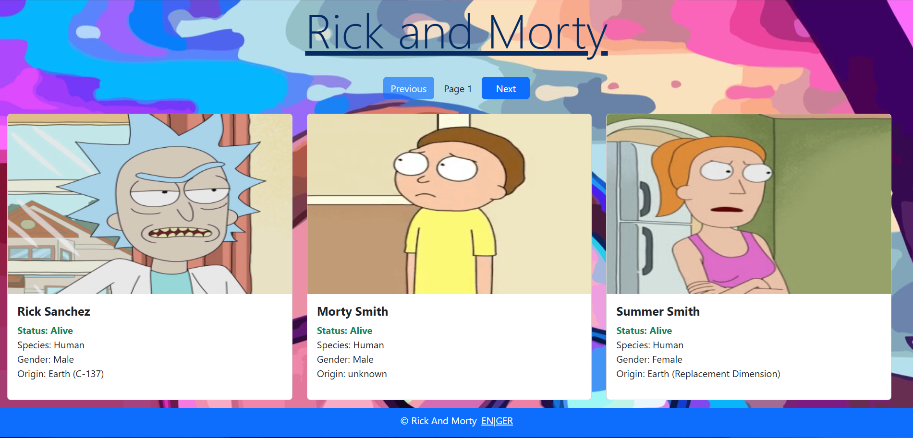
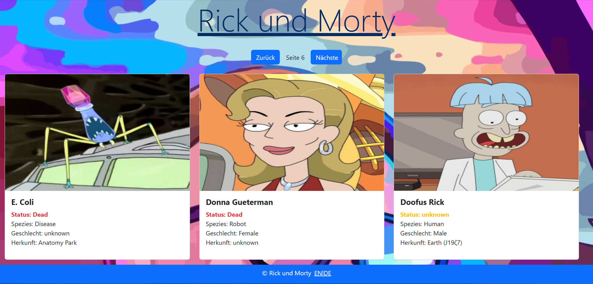
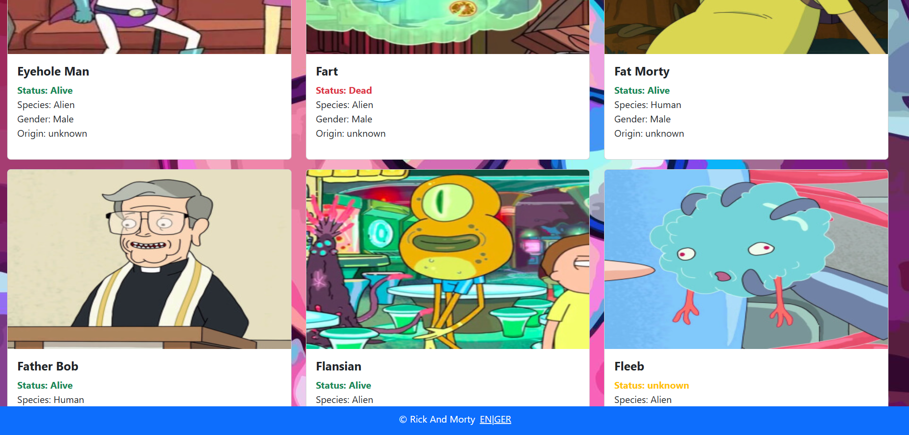

# RickAndMorty

A simple front-end application created to test the capabilities and learn more about GraphQL API. It is built with React that fetches and displays data from the Rick and Morty GraphQL API. The app includes pagination, supports both German and English languages, and is containerized with Docker for easy setup.

## Technologies involved:
<ul>
  <li>React</li>
  <li>Apollo Client (GraphQL)</li>
  <li>Bootstrap</li>
  <li>i18next for translations</li>
</ul>

## Starting:

To start the application easily without any problems, it is containerized and can be started with the following Docker commands:

1. Download and navigate to the project directory and run:
   ```bash
   docker build -t rick_morty .

2. Then run(different ports can be specified if needed):
   ```bash
   docker run -p 3000:3000 --name rick_morty_container rick_morty

3.Access the application on your localhost and the port specified.

## Showcase:




